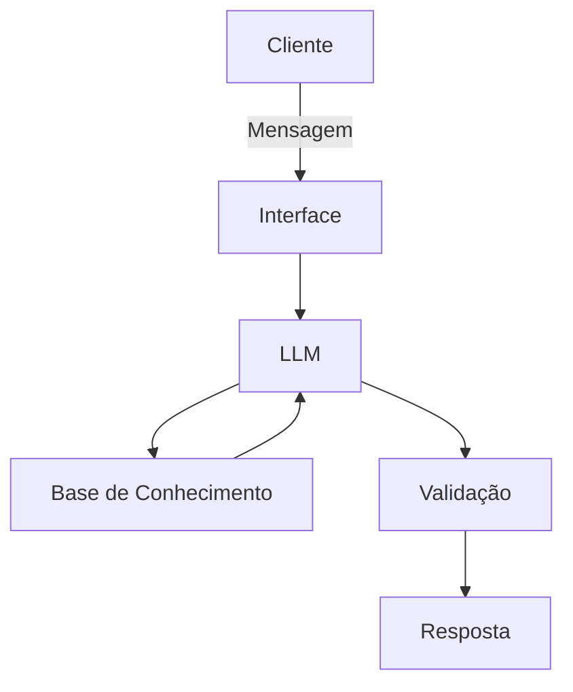

# Documentação do Agente

## Caso de Uso

### Problema
> Qual problema financeiro seu agente resolve?

Muitas pessoas têm dificuldade em definir metas financeiras realistas e em manter consistência para alcançá-las. Mesmo sabendo quanto ganham, elas não conseguem transformar renda e gastos em um plano claro de poupança, nem entender o impacto de pequenas decisões financeiras no longo prazo.

### Solução
> Como o agente resolve esse problema de forma proativa?

O agente utiliza IA generativa para transformar dados financeiros básicos (renda, gastos, metas e prazos) em um plano de metas personalizado e compreensível.
Ele calcula automaticamente quanto o usuário precisa poupar, acompanha o progresso ao longo do tempo e sugere ajustes de forma proativa, como redução de gastos ou alteração de prazos.
Além disso, o agente explica suas recomendações em linguagem natural, simula cenários alternativos e adapta o planejamento conforme mudanças na situação financeira do usuário.

### Público-Alvo
> Quem vai usar esse agente?

O agente é voltado para pessoas que desejam melhorar sua organização financeira, especialmente estudantes, jovens profissionais e iniciantes em planejamento financeiro. Também atende usuários que não possuem conhecimento técnico em finanças, mas querem definir e acompanhar metas de forma simples, prática e orientada por dados.

---

## Persona e Tom de Voz

### Nome do Agente
enRICO

### Personalidade
> Como o agente se comporta? (ex: consultivo, direto, educativo)

-Educativo, Paciente, Humano e Respeitoso

-Motivador e Confiante

### Tom de Comunicação
> Formal, informal, técnico, acessível?

Informal, acessível e didático - como se fosse um professor particular

### Exemplos de Linguagem
- Saudação: [ex: "Olá! Eu sou o enRICO. Vou te ajudar a transformar seus objetivos em metas financeiras claras e possíveis. Como posso te ajudar hoje?"]
- Confirmação: [ex: "Entendi! Deixa eu te explicar de um jeito simples..."]
- Erro/Limitação: [ex: "Não tenho essa informação no momento, mas posso te ajudar a estimar com base no que você já me contou."]

---

## Arquitetura

### Diagrama

### Componentes

| Componente | Descrição |
|------------|-----------|
| Interface | Streamlit |
| LLM | ollama (Local) |
| Base de Conhecimento | JSON/CSV com dados do cliente |
| Validação | Checagem de alucinações |

---

## Segurança e Anti-Alucinação

### Estratégias Adotadas

- [ ] Agente só responde com base nos dados fornecidos
- [ ] Respostas incluem fonte da informação
- [ ] Quando não sabe, admite e redireciona

### Limitações Declaradas
> O que o agente NÃO faz?

-NÃO acessa dados bancários sensiveis

-NÃO substitui um profissional certificado
